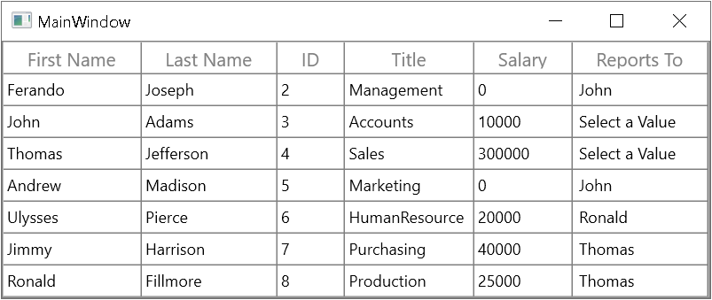

# How to Set the Default Display Text for GridComboBoxColumn in WPF DataGrid?

This sample show cases how to set the default display text for [GridComboBoxColumn](https://help.syncfusion.com/cr/wpf/Syncfusion.UI.Xaml.Grid.GridComboBoxColumn.html) in [WPF DataGrid](https://www.syncfusion.com/wpf-controls/datagrid) (SfDataGrid).

The `GridComboBoxColumn` does not have direct support to display default text on it when there is no selected Item in `DataGrid`. You can change the default text using ComboBoxValueConverter and DisplayBinding property of the column.

#### XAML
``` xml
<Window.Resources>
    <local:ComboBoxValueConverter x:Key="comboBoxValueConverter"/>
</Window.Resources>
<syncfusion:SfDataGrid Name="dataGrid"
                        AutoGenerateColumns="False"
                        AllowEditing="True"
                        ColumnSizer="Auto"
                        ItemsSource="{Binding Employees}">
    <syncfusion:SfDataGrid.Columns>
        <syncfusion:GridTextColumn MappingName="FirstName" HeaderText="First Name" ColumnFilter="DisplayText" />
        <syncfusion:GridTextColumn  MappingName="LastName" HeaderText="Last Name" />
        <syncfusion:GridTextColumn MappingName="ID"/>
        <syncfusion:GridTextColumn  MappingName="Title" />
        <syncfusion:GridTextColumn  MappingName="Salary" />
        <syncfusion:GridComboBoxColumn MappingName="ReportsTo" HeaderText="Reports To" ItemsSource="{Binding Reporters}" DisplayBinding="{Binding Path=ReportsTo, Converter={StaticResource comboBoxValueConverter}}"/>
    </syncfusion:SfDataGrid.Columns>
</syncfusion:SfDataGrid>
```
#### C#
```csharp
public class ComboBoxValueConverter : IValueConverter
{
    public object Convert(object value, Type targetType, object parameter, CultureInfo culture)
    {
        if (string.IsNullOrEmpty(value.ToString()))
            value = "Select a Value";
        return value;
    }

    public object ConvertBack(object value, Type targetType, object parameter, CultureInfo culture)
    {
        throw new NotImplementedException();
    }
}
```



## Requirements to run the demo
 Visual Studio 2015 and above versions